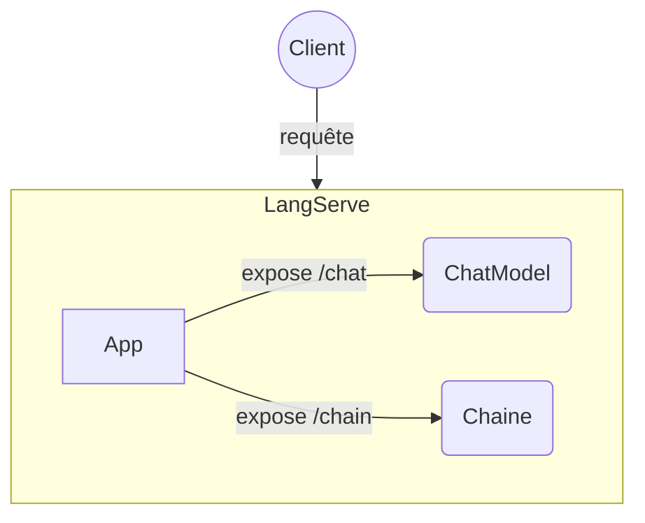

# LangChain - LangServe

## Objectifs

* Créer deux composants LangChain : un ChatModel et une chaîne
* Construire la partie Backend d'exposition
* Définir un client de test de notre exposition

## Etapes

### LangServe

Installer les packages `langserve` et `langchain-cli` puis utiliser la commande `langchain app new school-app` afin de créer une nouvelle application.
Dans le répertoire `school-app/app/` se trouve un fichier python `server.py`, qui va permettre d'exécuter LangServe.

### ChatModel et Chain

A partir des labs précédents construire :
- un `ChatModel` (ex: gemini-1.0-pro)
- une chaîne : avec un prompt, un appel à un LLM et un parser de sortie

Dans le fichier `server.py` ajouter les routes pour les `ChatModel` et `Chain` via la méthode `add_routes`
Y créer deux routes associées chacunes à l'un des chatbots, via la méthode static **add_routes**

### Client

#### Proposition de client python :
Définir un client python **RemoteRunnable** du package *langserve*, (par exemple dans un notebook dédié). 
A partir de lui, définir une liste de messages, voire utiliser un *input* utilisateur. Construisez une écriture LCEL du prompt et des exécutables pour déclencher l'appel via la méthode **batch**.

 La classe **RunnableMap** permet de définir plusieurs *Runnable* en un seul.
